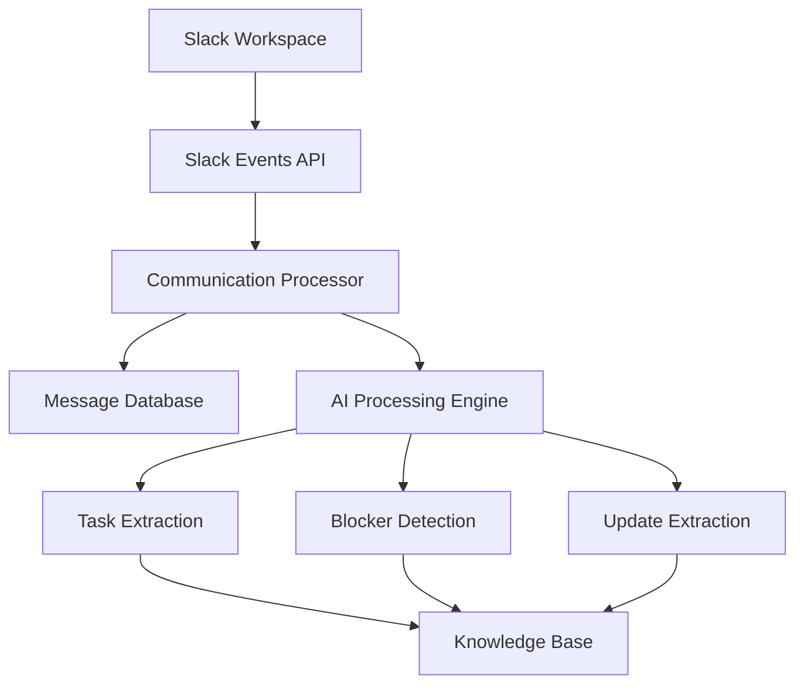

# Communication Intelligence Module

The Communication Intelligence module captures and processes Slack communication.

---

## Responsibilities

- Capture Slack messages
- Process communication events
- Extract tasks and blockers
- Detect urgent issues
- Update knowledge base

---

## Architecture

