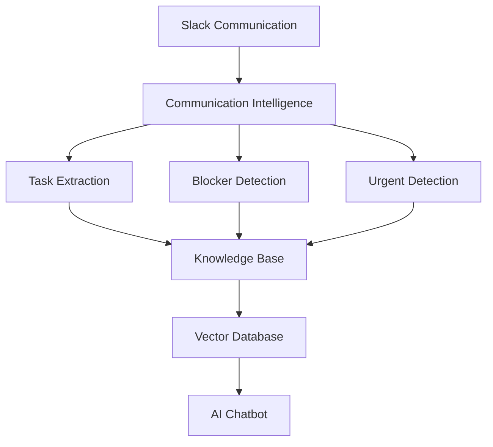

# Components of AI Project Manager

The AI Project Manager consists of several intelligent modules.

---

## Core Modules

1. Communication Intelligence
2. Task Extraction Engine
3. Blocker Detection System
4. Urgent Issue Detection
5. Knowledge Base
6. AI Chatbot

---

## Component Architecture

