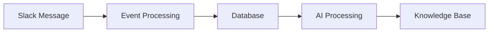
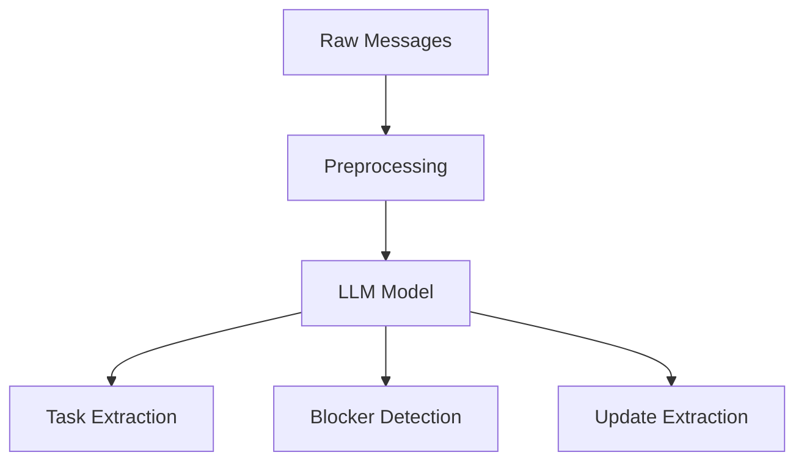

# System Diagrams

## Communication Pipeline

```mermaid
flowchart LR

A[Slack Message]

--> B[Event Processing]

--> C[Database]

--> D[AI Processing]

--> E[Knowledge Base]
```

---

## AI Processing Pipeline

```mermaid
flowchart TD

A[Raw Messages]

A --> B[Preprocessing]

B --> C[LLM Model]

C --> D[Task Extraction]

C --> E[Blocker Detection]

C --> F[Update Extraction]
```