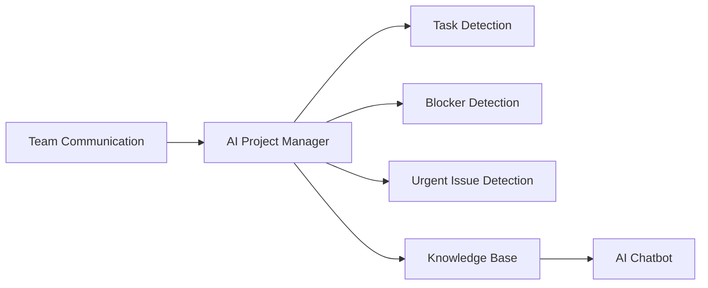

# AI Project Manager

## Overview

The AI Project Manager is an intelligent system designed to assist software development teams by analyzing communication and extracting meaningful project insights.

The system analyzes conversations from Slack workspaces and automatically identifies:

- Tasks
- Blockers
- Updates
- Urgent issues

These insights are stored in a knowledge base and can be queried using an AI chatbot.

---

## System Overview Diagram

