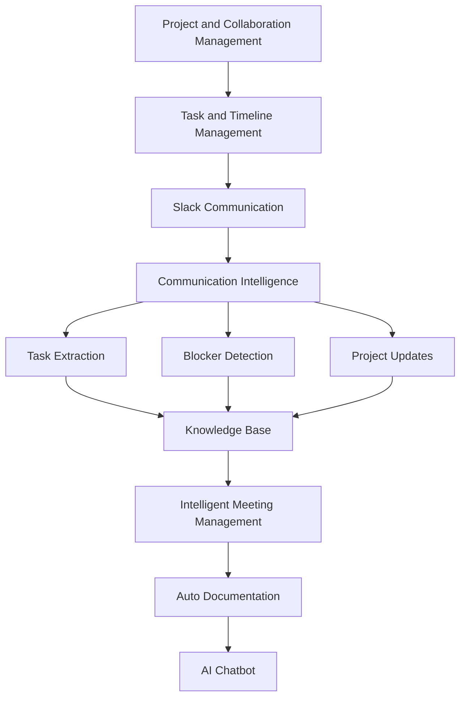
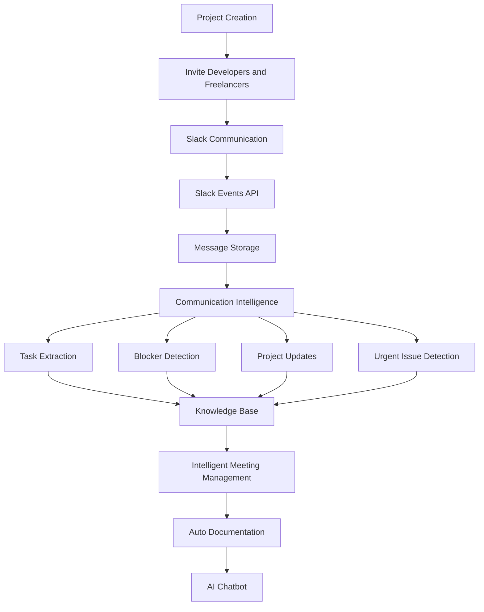

# Introduction

Modern software development teams rely on multiple tools for project management, communication, and documentation. Important information about tasks, project progress, discussions, and decisions is often scattered across different platforms such as Slack, meeting tools, and project trackers.

The **AI Project Manager** is designed to address this challenge by providing an intelligent system that integrates communication, project collaboration, and knowledge management into a unified platform.

The system uses Artificial Intelligence to analyze team communication, manage tasks and timelines, assist in meetings, and automatically generate documentation. By doing so, it helps development teams improve productivity, maintain project transparency, and reduce manual effort.

---

# AI Project Manager Overview

The AI Project Manager is composed of several intelligent modules that work together to manage project communication and workflow.

Key features include:

- **Project and Collaboration Management**  
  Enables teams to create projects, invite collaborators, and manage project workspaces.

- **Task and Timeline Discussion Management**  
  Tracks discussions related to tasks, deadlines, and project milestones.

- **Slack and Communication Intelligence**  
  Analyzes Slack conversations to extract tasks, blockers, and project updates.

- **Intelligent Meeting Management**  
  Helps teams manage meetings, capture discussions, and generate summaries.

- **Auto Documentation**  
  Automatically converts discussions and project insights into structured documentation.

These features enable the AI Project Manager to act as an intelligent assistant for software teams.

---

# Core Modules of AI Project Manager

The system consists of multiple modules working together to support project management activities.

1. Project and Collaboration Management
2. Task and Timeline Discussion Management
3. Communication Intelligence
4. Intelligent Meeting Management
5. Auto Documentation
6. Knowledge Base and AI Chatbot

Each module processes different types of project information and contributes to building a centralized knowledge system.

---

# AI Project Manager Architecture

---

# End-to-End System Workflow

The AI Project Manager follows a structured workflow to manage project communication and generate insights.

---

## Step 1: Project Creation

An administrator creates a project within the platform and selects a Slack workspace for communication.

The system then creates a dedicated project channel where team members collaborate.

---

## Step 2: Team Collaboration

Developers, project managers, and freelancers are invited to join the workspace through email invitations.

Team members communicate through Slack channels, discussing tasks, timelines, and project updates.

---

## Step 3: Communication Capture

Slack Events API sends communication events to the backend system.  
All messages and conversations are stored in the message database.

---

## Step 4: Communication Intelligence Processing

The Communication Intelligence module analyzes conversations using AI models.

The system extracts:

- Tasks
- Blockers
- Project updates
- Important decisions

---

## Step 5: Urgent Issue Detection

The system also detects urgent issues such as:

- Production failures
- Deployment problems
- Critical bugs

When detected, alerts are generated for the team.

---

## Step 6: Knowledge Base Generation

All extracted insights are stored in a knowledge base which organizes project information in a structured format.

This knowledge base enables future search and AI-driven responses.

---

## Step 7: Intelligent Meeting Management

The system supports meeting discussions by summarizing key points and storing them as structured meeting records.

This helps teams maintain a clear record of decisions and action items.

---

## Step 8: Auto Documentation

The Auto Documentation module automatically generates documentation from project discussions, extracted insights, and meeting summaries.

This reduces the need for manual documentation.

---

## Step 9: AI Chatbot Assistance

Developers and project managers can query the system through an AI chatbot.

The chatbot retrieves information from the knowledge base and provides intelligent answers related to the project.

---

# Complete System Workflow Diagram

---

# Benefits of the AI Project Manager

The system provides several benefits for development teams:

- Improved visibility into project communication
- Early detection of blockers and urgent issues
- Automated documentation of project activities
- Centralized knowledge management
- Intelligent project insights through AI

By integrating communication intelligence with project management capabilities, the AI Project Manager helps teams work more efficiently and maintain better control over their projects.