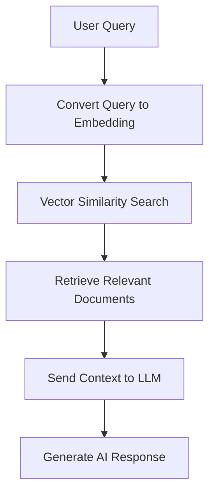
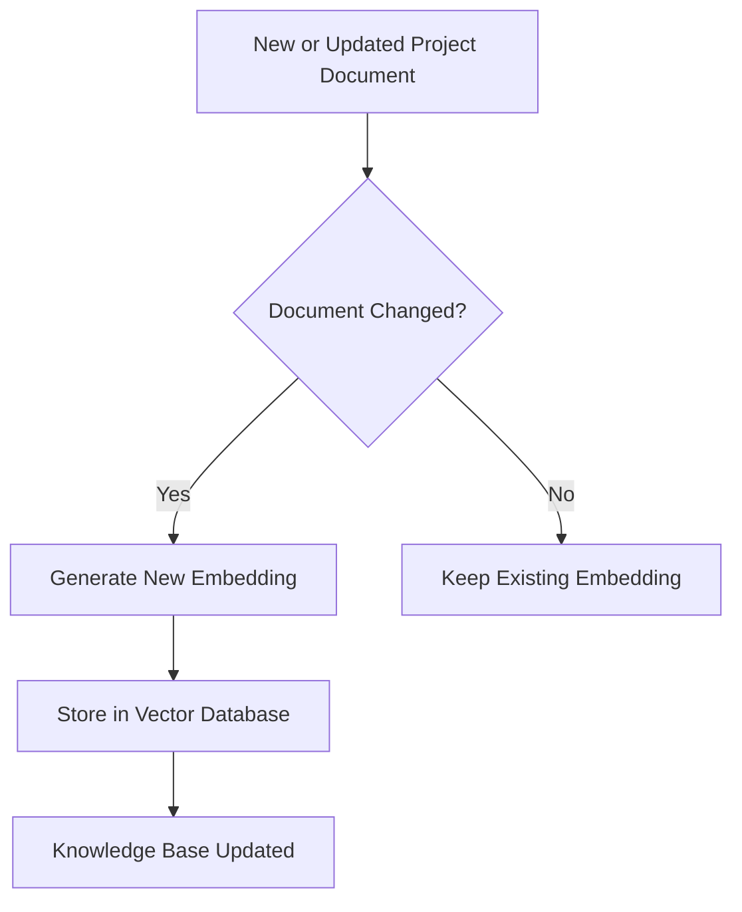

# Knowledge Base & RAG System

The **Knowledge Base** stores structured insights extracted from communication such as:

- Tasks
- Blockers
- Project updates
- Meeting summaries
- Important decisions

These insights are converted into documents that form the project knowledge repository.

To enable intelligent querying, the system uses a **Retrieval Augmented Generation (RAG)** architecture where documents are indexed using **vector embeddings**.

This allows the AI system to retrieve relevant information based on semantic similarity rather than keyword matching.

---

# Incremental Embedding Updates

To optimize performance and reduce unnecessary computation, the system **does not regenerate embeddings for all documents every time**.

Instead, embeddings are updated **incrementally**.

The system only generates embeddings for:

- Newly created documents
- Updated documents
- Newly extracted project insights

Existing documents that have not changed **retain their previously generated embeddings**.

This approach provides several benefits:

- Faster embedding updates
- Reduced computational cost
- Efficient knowledge base maintenance
- Scalability for large projects

---

# RAG Workflow

The RAG pipeline retrieves relevant information from the knowledge base before generating an AI response.

---

# Incremental Embedding Update Workflow

The following workflow illustrates how the system updates embeddings only when necessary.

---

# Benefits of Incremental Embedding Updates

- Reduces processing overhead
- Improves system performance
- Avoids duplicate embedding generation
- Ensures the knowledge base remains up-to-date