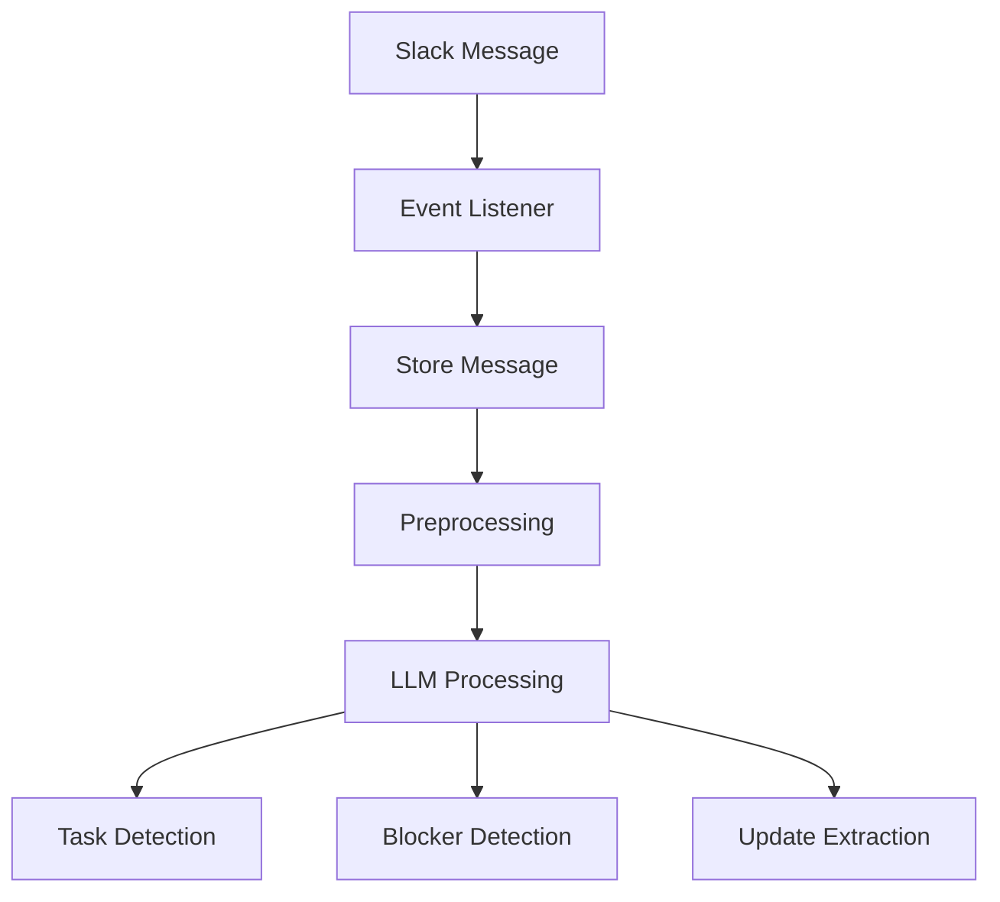

# Message Processing

All Slack messages are processed through an AI pipeline.

---

## Processing Pipeline

# Slack Message Processing Startegies

To handle Slack messages efficiently, we will follow **two complementary processing strategies**:

## 1. Real-Time Processing

- **Description:** Messages are processed immediately as they arrive in Slack channels or DMs.
- **Use Case:** Ideal for time-sensitive tasks like detecting blockers, urgent queries, or immediate task updates.
- **Implementation:** Triggered via Slack Events API → FastAPI endpoint → Processing pipeline → Database/Task updates.

## 2. Batch Processing (Every 2 Hours)

- **Description:** Messages are collected and processed in bulk every 2 hours.
- **Use Case:** Useful for generating summaries, analytics, and reviewing accumulated messages for patterns or insights.
- **Implementation:** Scheduled job (e.g., via cron or background scheduler) → Fetch unprocessed messages → Process → Update summaries, tasks, or insights.

## Why Two Strategies?

- Real-time ensures critical updates are captured instantly.
- Batch ensures efficiency for non-urgent tasks and reduces overhead on processing high message volumes.