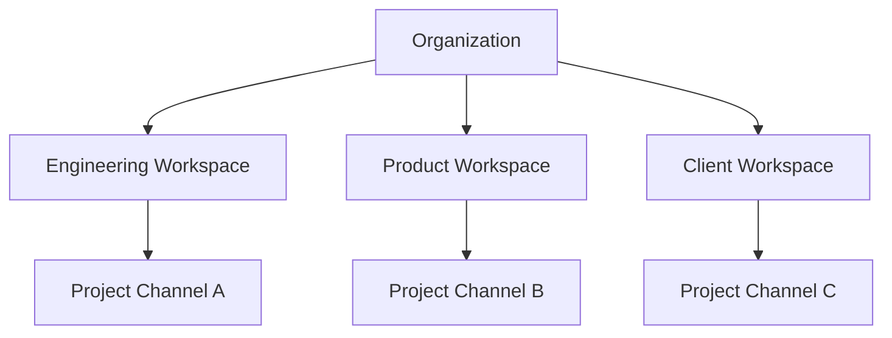

# Slack Workspace Strategy

Projects may use multiple Slack workspaces.

---

## Options

### Multiple Workspaces
Engineering, Product, Client workspaces.

### Slack Connect (Paid)
Cross-organization collaboration.

### Private Channels (Free Plan)
Recommended for free Slack usage.

---

## Strategy Diagram

