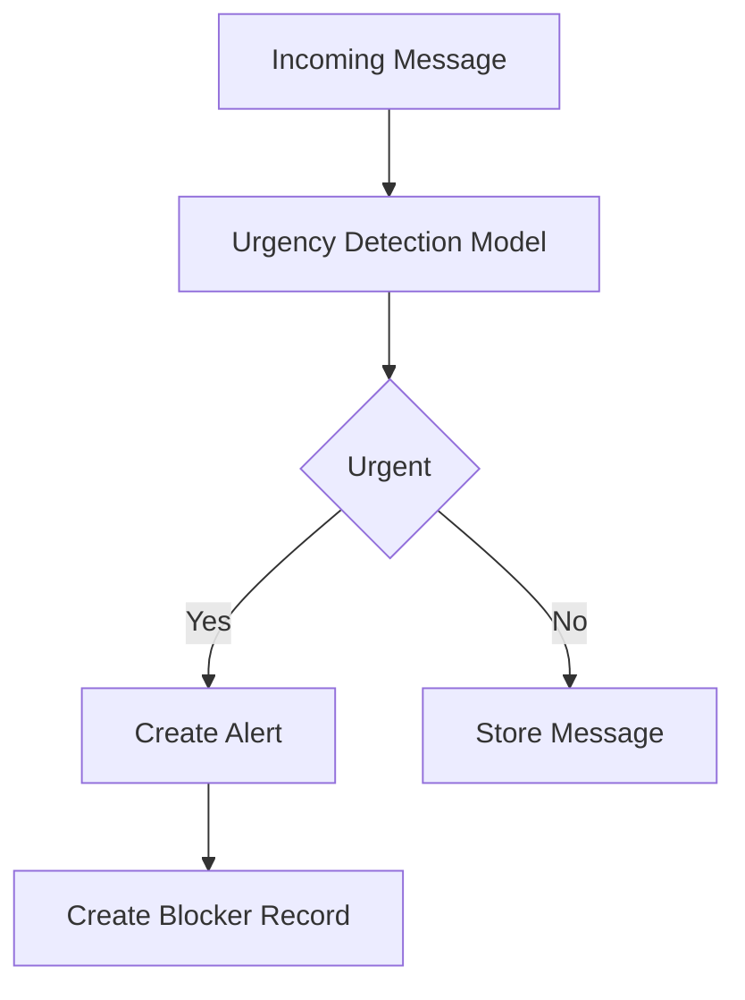

# Urgent Issue Detection

The system detects urgent problems from communication in real time.

Examples include:

- Production failure
- Deployment errors
- Critical bugs

---

## Detection Flow

```mermaid
flowchart TD

A[Incoming Message]

A --> B[Urgency Detection Model]

B --> C{Urgent}

C -->|Yes| D[Create Alert]

D --> E[Create Blocker Record]

C -->|No| F[Store Message]
```