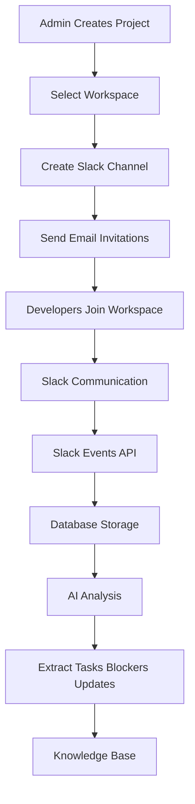

# End to End Workflow

---

## Workflow Steps

1. Admin creates project
2. Slack workspace selected
3. Project channel created
4. Developers invited via email
5. Communication begins in Slack
6. Slack events captured
7. Messages stored in database
8. AI analyzes messages
9. Tasks and blockers extracted
10. Knowledge base updated

---

## Workflow Diagram

